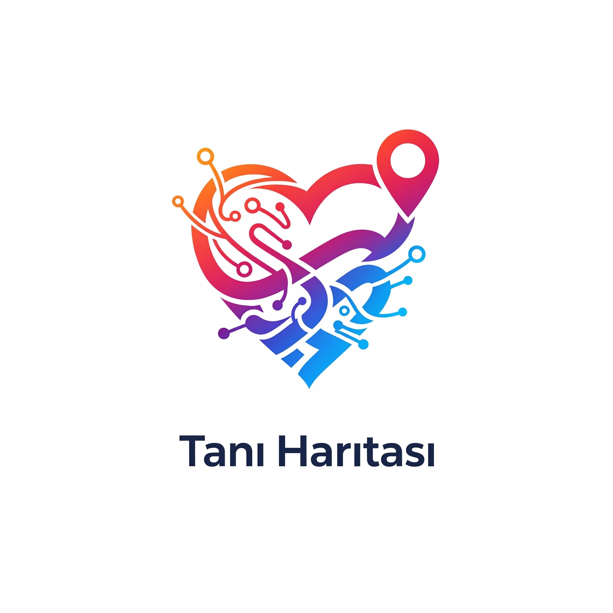
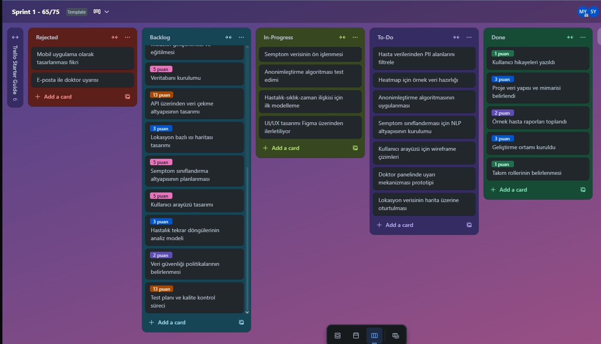
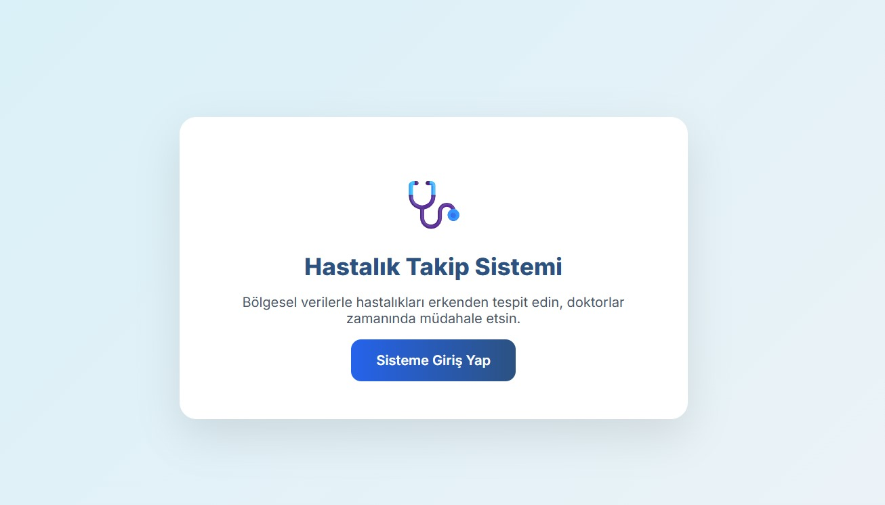
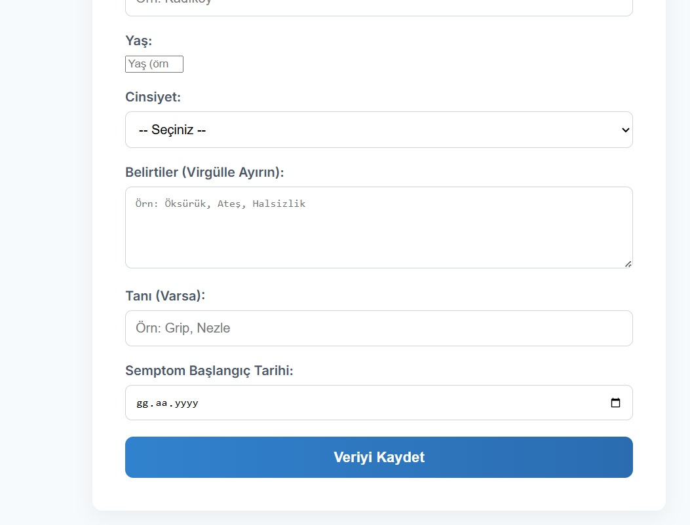
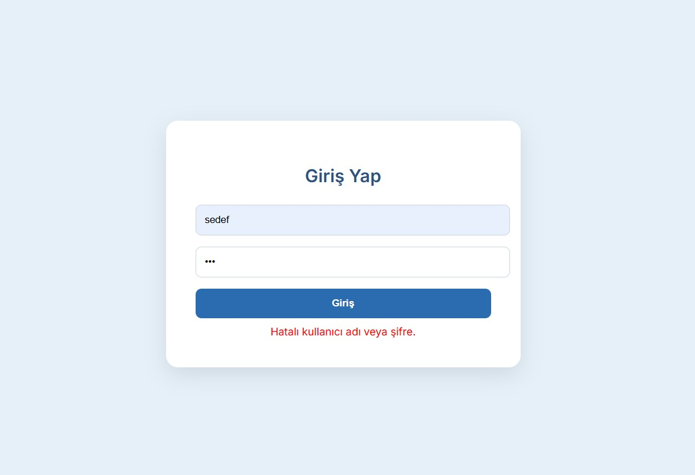
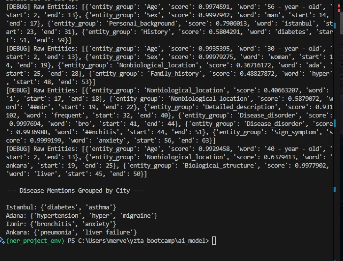

# Tanı Haritası

<!-- LOGO -->
<p align="center">
  
</p>

<h1 align="center">Veri Bilimi ve Yapay Zeka Tabanlı Hastalık Takip Sistemi</h1>

<p align="center">
  Doktor muayeneleri sonrası anonimleştirilmiş hasta verileriyle oluşturulan, bölgesel hastalık ısı haritası. <br>
  Bu sistem sayesinde viral hastalıklar hızlıca tespit edilir, civardaki doktorlar uyarılır ve teşhis süreçleri hızlanır.
</p>

---

## 👥 Takım Üyeleri

| | **İsim** | **Rol** | **LinkedIn** |
|---|---|---|---|
|  | **Merve** | Ürün Sahibi | [LinkedIn](https://www.linkedin.com/in/merve-yagiz) |
|  | **Begüm** | Scrum Master | [LinkedIn](https://www.linkedin.com/in/begumbeyzakocahuyuk) |
|  | **Sedef** | Geliştirici | [LinkedIn](https://www.linkedin.com/in/sedef-yıldırımci) |
|  | **Deniz** | Geliştirici | 
|  | **Alpay** | Geliştirici | 

---

## 📌 Proje Konusu

Bu proje; hasta verilerindeki **kişisel bilgiler (PII)** filtrelenerek, yapay zeka destekli bir sistemle **ısı haritası oluşturarak** sağlık alanında farkındalık yaratmayı hedeflemektedir.

Amaçlarımız:
- PII’siz hasta verileriyle viral hastalıkları tespit etmek
- Harita üzerinden semptomlara dayalı dağılımları analiz etmek
- Lokasyon-temelli doktor uyarı sistemleri geliştirmek
- Hastalık tekrar döngülerini zaman serisi analizleriyle tespit etmek

---

## 🛠️ Kullanılan Teknolojiler


---

## 🚀 Kurulum

Projeyi yerelde çalıştırmak için:

```bash
git clone https://github.com/begumkocahuyuk/grup146.git
cd Grup146
npm install
npm start
```

---

## 📋 Sprint 1

### 🎯 Sprint Hedefi:
Sprint 1’de temel altyapıların hazırlanması, kullanıcı hikâyelerinin netleştirilmesi ve anonimleştirme algoritmalarının temel prototiplerinin oluşturulması hedeflenmiştir.

### 🔢 Tahmini Puan: 60  
### ✅ Gerçekleşen Puan: 45  

> Puanlama, işin karmaşıklığı, veri miktarı, teknik zorluk ve bağımlılıklar göz önüne alınarak belirlenmiştir. Küçük işler: 3 puan, orta işler: 5–8 puan, karmaşık işler: 13 puan üzerinden hesaplandı.

---
### 🎯 Daily  Scrum:
Daily Scrum toplantılarının Google Meet veya Zoom üzerinden yapılması kararlaştırılmıştır. Daily Scrum toplantımız Imgur'a eklenmiştir.[Ekran Görüntüleri için buraya tıklayın](https://imgur.com/a/EMr6MK5)

### ✅ Tamamlananlar (Done):
- Kullanıcı hikayeleri yazıldı
- Proje yapı/mimari planı oluşturuldu
- Anonimleştirilmiş örnek raporlar toplandı
- Geliştirme ortamı kuruldu
- Takım rolleri belirlendi

### 🔧 Devam Edenler (In Progress):
- Semptom verisinin ön işlenmesi
- Anonimleştirme algoritmasının testleri
- İlk modelleme (hastalık - zaman - sıklık ilişkisi)
- UI/UX tasarımının Figma üzerinden devamı

### 📌 Yapılacaklar (To Do):
- Hasta verilerinden PII bilgilerin çıkarılması (isim, TC vs.)
- Heatmap için örnek veri hazırlanması
- NLP ile semptom sınıflandırma altyapısı kurulması
- Kullanıcı arayüzü wireframe çizimleri
- Doktor paneli uyarı mekanizması
- Lokasyon verisinin harita üzerinde oturtulması

### ❌ Reddedilenler (Rejected):
- Mobil uygulama olarak tasarlanması
- E-posta uyarısı yerine push notification tercih edildi

---

### 🧐 Sprint Review
- Demo başarıyla tamamlandı ve ürün sahibine sunuldu.
- UI/UX ilk versiyonu onaylandı.
- Anonimleştirme mantığı demo üzerinden anlatıldı.
- Geri bildirim: Harita üzerinde görsellik geliştirilmeli, NLP çıktıları sprint 2’ye taşınmalı.

---

### 🔁 Sprint Retrospective

**İyi Gidenler:**
- Takım içi görev paylaşımı
- Trello üzerinden görev takibi disiplinli yürütüldü

**İyileştirme Gerekenler:**
- Kartlar daha modüler/parçalı tanımlanmalı
- Puanlama planlamadan önce netleştirilmeli

**Kararlaştırılan Aksiyonlar:**
- Günlük 15 dk stand-up zorunlu hale getirildi
- UI kararları sprint başında ortaklaşa netleştirilecek

## 🧭 Trello Sprint Panosu (Sprint 1)

<p align="center">
  
</p>

---

## 📋 Sprint 2
### 🎯 Sprint Hedefi:
Sprint 2'de, temel veri giriş arayüzünün, bölgesel vaka sayısı raporlama ekranlarının ve ana gezinme (dashboard) yapısının UI/UX prototiplerinin oluşturulması hedeflenmiştir.
### 🔢 Tahmini Puan: 60  
### ✅ Gerçekleşen Puan: 55

Puanlama, işin karmaşıklığı, veri miktarı, teknik zorluk ve bağımlılıklar göz önüne alınarak belirlenmiştir. Küçük işler: 3 puan, orta işler: 5–8 puan, karmaşık işler: 13 puan üzerinden hesaplandı.
### 🎯 Daily  Scrum:
Daily Scrum toplantılarının Google Meet veya Zoom üzerinden yapılması kararlaştırılmıştır. Daily Scrum toplantımız Imgur'a eklenmiştir.[Ekran Görüntüleri için buraya tıklayın](https://imgur.com/a/EMr6MK5)
### ✅ Tamamlananlar (Done):
 * Yeni Hasta Veri Girişi Arayüzü Geliştirildi: İl, ilçe, yaş, cinsiyet, belirtiler, tanı ve semptom başlangıç tarihi alanlarını içeren form ekranı tasarlandı.
 * Sisteme Giriş (Login) Arayüzü Oluşturuldu: Kullanıcı adı ve şifre girişine sahip bir giriş ekranı ve hatalı giriş uyarısı tasarlandı.
 * Ana Dashboard ve Gezinme Arayüzü Tasarlandı: Sisteme giriş sonrası kullanıcıyı karşılayan ve ana modüllere (Isı Haritası, Semptom Analizi, Uyarı Paneli, Veri Girişi) yönlendiren ana ekran oluşturuldu.
 * Bölgesel Vaka Sayısı Raporlama Arayüzleri Tamamlandı:
   * İstanbul İlçelerine Göre Vaka Sayısı (tablo ve grafik) arayüzü.
   * Ankara İlçelerine Göre Vaka Sayısı (tablo ve grafik) arayüzü.
   * İzmir İlçelerine Göre Vaka Sayısı (tablo ve grafik) arayüzü.
   * Farklı Bölgelere Göre Güncel Vaka Sayısı (tablo ve genel grafik) arayüzü.
 * Sistem Tanıtım ve Giriş Sayfası Oluşturuldu: Projenin amacını belirten başlangıç sayfası hazırlandı.
🔧 Devam Edenler (In Progress):
 * Semptom Verisinin Ön İşlenmesi: Arayüzden girilen semptomların standartlaştırılması üzerine temel çalışmalar devam ediyor. (Sprint 1'den taşındı)
 * UI/UX Tasarımının Figma Üzerinden Detaylandırılması: Tüm arayüzlerin tutarlı bir tasarım diline sahip olması için Figma çalışmaları sürüyor.
### 📌 Yapılacaklar (To Do):
 * Heatmap İçin Örnek Veri Hazırlanması: Harita üzerinde yoğunluk gösterimi için gerekli veri setinin oluşturulması.
 * NLP ile Semptom Sınıflandırma Altyapısı Kurulması: Girilen semptomları kategorize etmek için Doğal Dil İşleme altyapısının kurulumu.
 * Doktor Paneli Uyarı Mekanizması: Doktor panelindeki uyarılar için temel işlevselliklerin ve arayüzün belirlenmesi.
 * Lokasyon Verisinin Harita Üzerinde Oturtulması: Bölgesel vaka verilerinin harita üzerinde görselleştirilmesi.
### 🧐 Sprint Review
 * Demo başarıyla tamamlandı ve ürün sahibine sunuldu.
 * Hasta veri giriş formu ve bölgesel raporlama arayüzlerinin net ve kullanılabilir olduğu onaylandı.
 * Giriş ve ana sayfa ekranlarının kullanıcı deneyimi açısından iyi bir temel oluşturduğu geri bildirimi alındı.
 * Geri bildirim: Harita üzerindeki görsellik ve NLP çıktıları bir sonraki sprintte daha somut olarak gösterilmesi beklentisi dile getirildi.
### 🔁 Sprint Retrospective
İyi Gidenler:
 * Takım içi görev paylaşımı ve iş birliği iyileşti.
 * Trello üzerinden görev takibi disiplinli bir şekilde yürütüldü.
İyileştirme Gerekenler:
 * Puanlama tahminlerinde hala iyileşme alanı bulunuyor.
 * Arayüzlerin backend entegrasyonu detayları daha erken netleştirilmeliydi.
Kararlaştırılan Aksiyonlar:
 * Günlük 15 dk stand-up zorunlu hale getirildi.
 * UI kararları sprint başında ortaklaşa netleştirilecek.
 * Bir sonraki sprintte backend entegrasyonuna öncelik verilecek.
 <p align="center">
  
  
  
  

</p>
